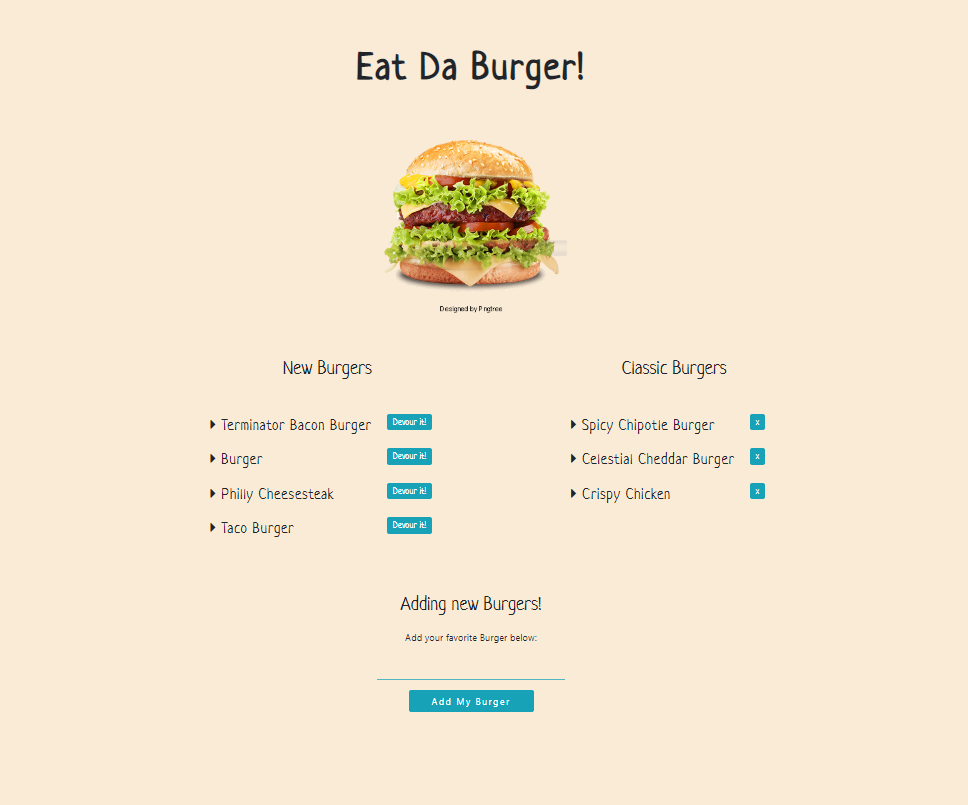

# University of Central Florida
### Coding Bootcamp 
#### Full Stack Developer 

- - - - - - - - - - - - - - - - - - - - - - - - - - - - - - - - - - - - - - - - -

# Express, MySQL & Handlebars
## Eat Da Burger

##### What does Eat Da Burger is the best application

##### Get Ready

Before trying to run this app you must have **install the following npm packages**:

* express
* handlebars 

To learn more about this packages, click [here!](https://www.npmjs.com/)

##### How do I run it?
The user should run this code on the my local server? First run "node server.js" on the terminal, and then use the following urls:

* localhost:8080

## [Click here to see the demo](https://drive.google.com/file/d/1aZVM8YVKJed151XqVUnN6MwYWl8dkHHc/view)

If you are interested only on my code, [click me!](https://marciagzq.github.io/Burger/.)

*If any suggestion, do not hesitate to contact me on my personal email: marcia.gzq@gmail.com
I would appreciate any comment, I know it may be very beneficial on my professional growth.*